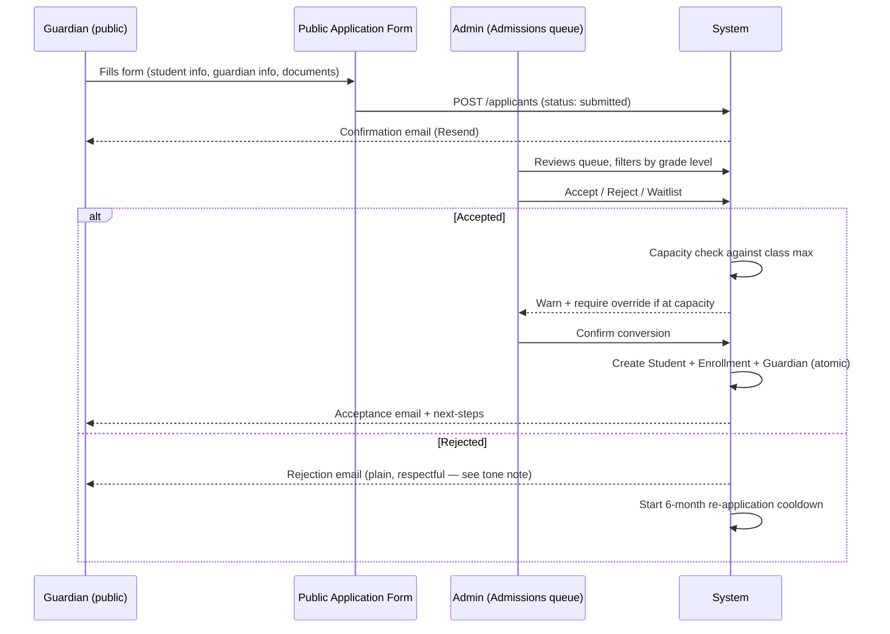
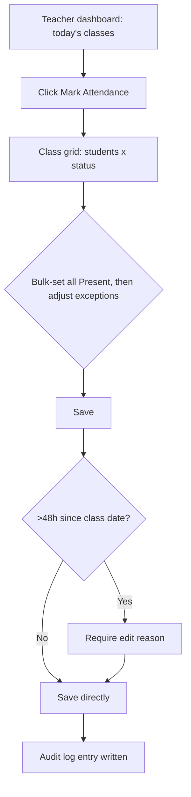
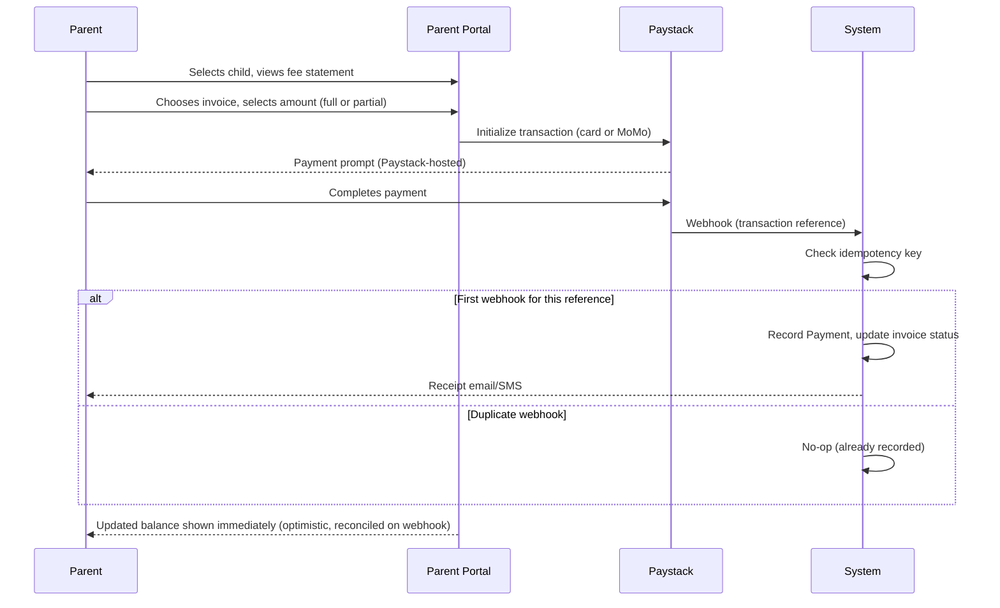
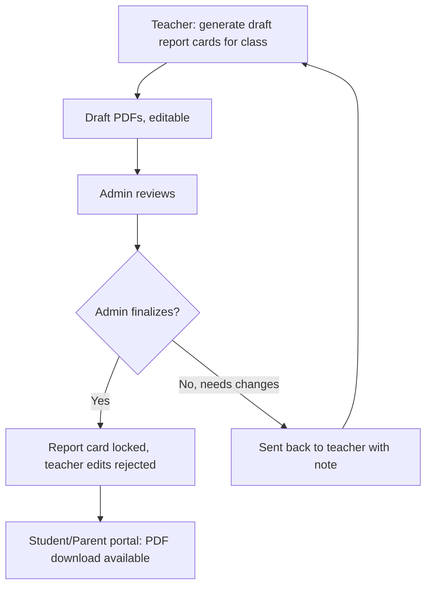

# EduNexus — Key User Flows

> Grounded in the actual issues already shipped/planned in `ROADMAP.md`. Each flow notes where the Term Ribbon, role-accent, and tone-of-voice rules from the design docs actually apply — this is meant to be read alongside `01-DESIGN-PHILOSOPHY.md` and `02-DESIGN-SYSTEM.md`, not as a separate spec.

---

## Flow 1 — Applicant → Student (Admissions, Phase 3a)

Covers issues #48/#49/#50/#51 (already shipped) end to end.



**Tone note (ties to Philosophy §8):** the rejection email is the single highest-stakes piece of copy in this flow. Draft direction: *"Thank you for applying to [School]. We're not able to offer a place this term. You're welcome to apply again after [date]."* No corporate hedging ("unfortunately, at this time..."), no false warmth, no jargon like "application status: REJECTED" — a real headteacher's office would never phrase it that way to a parent.

**Design surfaces touched:** public form uses tenant branding (§2 System doc §6) since it's a front-of-house, pre-login surface — this is a school's actual "storefront." Admin review queue uses admin ochre accent, standard internal chrome.

---

## Flow 2 — School Setup Wizard (Phase 3.7, issues #128/#129)

```mermaid
flowchart LR
  A[Super admin: 2-field form] --> B[School created, status: setup_pending]
  B --> C[Welcome email to admin]
  C --> D[Admin first login]
  D --> E[Wizard: Profile]
  E --> F[Wizard: Contact]
  F --> G[Wizard: Academic Config]
  G --> H[Wizard: Branding + live preview]
  H --> I[Wizard: Grade Levels]
  I --> J[Wizard: Academic Year + Terms]
  J --> K[Review & Complete]
  K --> L[Status: active — dashboard unlocks]
```



**Design-specific requirements not in the original functional spec:**
- Progress through the 7 steps is shown as the Term-Ribbon color-block rhythm (System doc §3, Forms), not a generic numbered stepper — this is the wizard's first exposure to the product's signature motif, so it should feel considered from minute one, not bolted on later.
- The **Branding step** (H) is where §6 of the system doc actually gets exercised: color picker → server-side OKLCH contrast check → live preview of login page + a sample report card corner, updating in real time. If the chosen color fails contrast, the preview shows the *corrected* color with a one-line explanation, never a silent substitution.
- Resuming mid-wizard (AC in `ROADMAP.md` #129) should visually pick up exactly where the ribbon left off — the ribbon *is* the progress-save indicator, not a separate "step 4 of 7" text label.

---

## Flow 3 — Teacher Attendance Marking (Phase 4.2, issue #54)



**Design note:** default every student to "Present" on grid load (most days, most students attend) — the teacher's real job is marking *exceptions*, and the UI should be designed around that reality (tap absent/late for the 2–3 students who need it) rather than forcing 30 individual taps. This is a usability decision that falls out of actually thinking about the daily ritual, not a generic "select all" checkbox pattern.

**Color:** status chips use the universal status scale (System §2), not role-accent — attendance state (present/absent/late/excused) is semantic, not wayfinding, so it must stay legible and consistent regardless of which role is viewing it (teacher marks it, student/parent later view the same colors).

---

## Flow 4 — Parent Fee Payment (Phase 6.3, issue #66)



**Design note:** show the updated balance optimistically the moment Paystack's client-side callback fires (don't make the parent wait for the webhook round-trip to see feedback), but reconcile silently against the webhook's authoritative record — if they ever disagree, trust the webhook and correct the UI without alarming the parent (a payment succeeded; the UI catching up a few seconds late is not an error state).

**Color:** this is a front-of-house, tenant-branded surface (parent portal payment screens) — the "Pay Now" primary button uses `--color-tenant-accent`, not the generic parent terracotta, since real money is changing hands and the parent should feel they're paying *this specific school*, not a generic platform.

---

## Flow 5 — Report Card Generation & Lock (Phase 4.4, issue #56)



**Design note:** the finalized/locked report card is the highest-ceremony document in the whole product — this is where the Fraunces display face, the school's logo, the headteacher signature block, and (if branded) the tenant accent trim all appear together for the first time. It should look and feel meaningfully different from every other screen in the app: quieter chrome, more whitespace, paper-toned background even in dark mode (System doc §5).

---

## Flow 6 — Support Impersonation (§16.2, issue #102)

```mermaid
flowchart LR
  A[Super admin: cross-tenant dashboard] --> B[Selects school, clicks View As Admin]
  B --> C[Impersonation session starts, 30-min timer]
  C --> D[Persistent banner: Viewing as {admin name} at {school} - Exit]
  D --> E{Action taken?}
  E -->|Yes| F[Audit log: real super_admin id + impersonated user id]
  E -->|Timer expires or Exit clicked| G[Session ends, returns to platform console]
```

**Design note:** the impersonation banner is deliberately styled in the **platform graphite accent**, never the school's own branding or the admin role accent — this is the one moment the interface must make unmistakably clear that "this is not really the school's normal experience," overriding every other chrome rule in this system on purpose. It should feel slightly alarming (in a good way) — closer to a browser's "recording" indicator than a normal UI element.